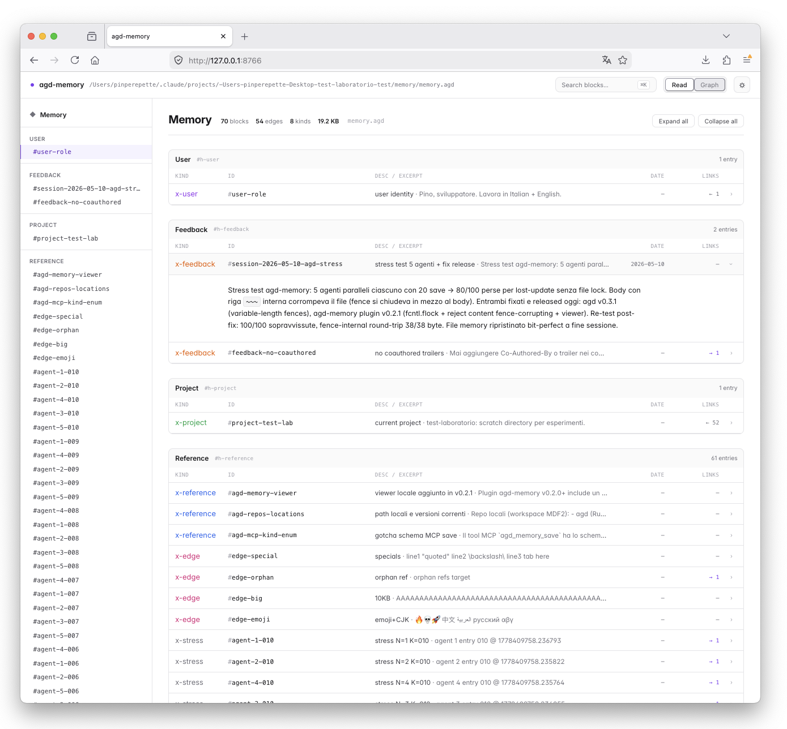
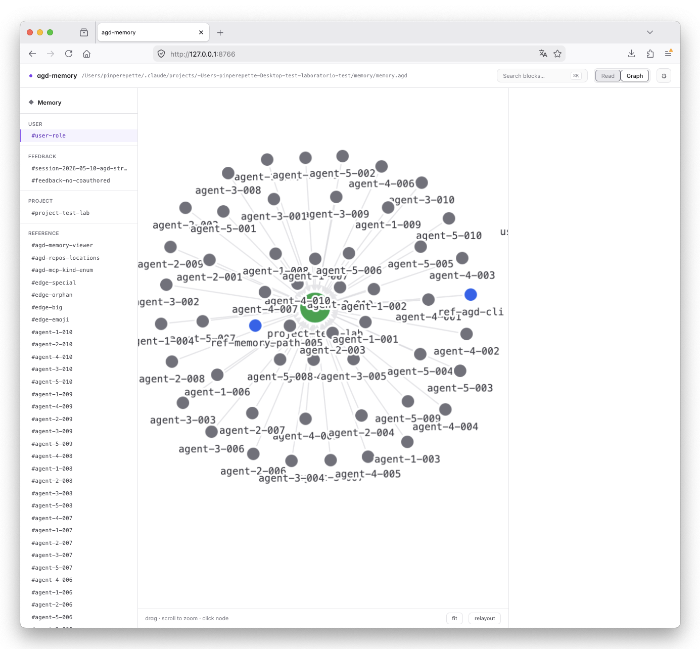
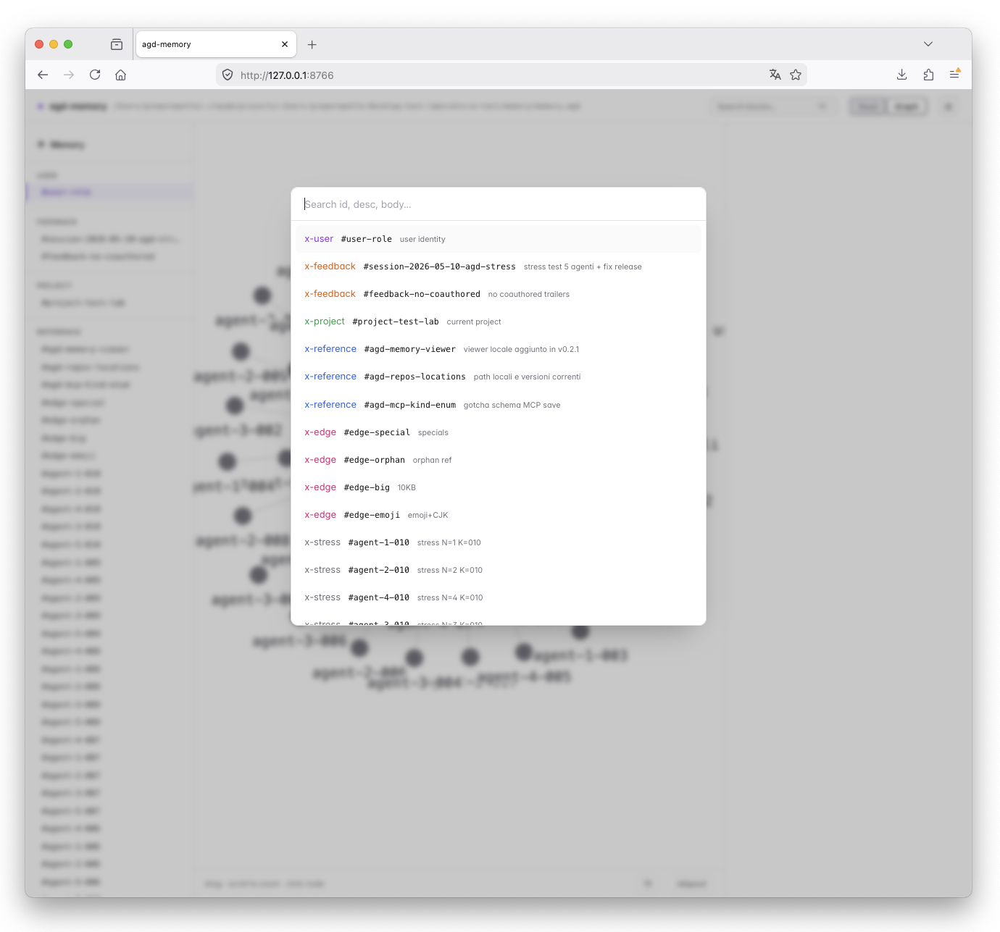

# agd-memory


Per-project persistent memory for [Claude Code](https://claude.com/claude-code),
stored in [AGD format](https://github.com/Pinperepette/agd) with selective
retrieval and graph traversal.

Each project gets its own memory file. The session never loads it whole:
it scans a Table of Contents, picks the relevant blocks, and fetches
them in a single batched call. Typical access costs **6-15x fewer
tokens** than loading the whole memory file.

## What you get

- **SessionStart hook** — at session start, injects the TOC of the
  project memory into the system context. If the project has no
  memory, the hook is a silent no-op.
- **UserPromptSubmit hook (auto-recall)** — on every prompt, scores
  every block by keyword overlap with what the user just typed and
  injects the top few full block bodies. Skips silently on empty/short
  prompts, pasted code, or when nothing clears the relevance floor. TOC
  and auto-recall are complementary: the TOC tells the model what
  exists, recall surfaces what's relevant right now.
- **SessionEnd hook (auto-capture)** — after a substantial session, a
  headless `claude -p` pass reads the transcript and persists what was
  durable: decisions with their rationale, root causes, preferences.
  Trivial sessions are gated out before any LLM call is spent, and
  transient API failures are retried instead of losing the session's
  knowledge. This is what makes memory accumulate without the user
  having to say `/remember`.

  > **Upgrading from a hand-installed distiller?** Remove the old
  > `SessionEnd`/`SessionStart` entries pointing at `~/.claude/hooks/`
  > from `~/.claude/settings.json` — but only *after* the installed
  > plugin actually carries this version. Claude Code loads the plugin
  > from `~/.claude/plugins/`, which is a clone of the published
  > remote, not your working checkout: an older installed copy registers
  > only `SessionStart`, so removing the local hook first turns
  > distillation off entirely. Check with
  > `python3 -c "import json;print(list(json.load(open('$HOME/.claude/plugins/marketplaces/agd-memory/hooks/hooks.json'))['hooks']))"`.
  > While developing against a checkout that is ahead of the published
  > plugin, point a local `SessionEnd` entry at your checkout's
  > `hooks/agd-memory-distill.sh`. The hook locks on the *resolved memory
  > file*, so a local hook and a plugin hook cannot both distil the same
  > memory — including the case where two checkouts of one repo map onto
  > one memory file through the git-remote index. A copy that cannot
  > resolve the memory file (no `lib/` alongside it) skips rather than
  > guessing a key, so it can never diverge into a second run.
  >
  > That lock covers distillers only: a live session writing memory at
  > the same time is serialised by the writer's own flock, which prevents
  > a corrupt file but not two independent decisions about what to record.

  | Var | Default | Purpose |
  | --- | --- | --- |
  | `AGD_DISTILL_DISABLED` | unset | hard kill switch |
  | `AGD_DISTILL_MODEL` | `claude-sonnet-4-6` | model for the headless pass |
  | `AGD_DISTILL_RETRIES` | `3` | attempts before giving up on a transient failure |
  | `AGD_DISTILL_BACKOFF_S` | `30` | backoff base, grows linearly per attempt |
  | `AGD_DISTILL_LOCK_STALE_S` | `1800` | age at which a held lock is treated as abandoned |
- **Skill** (`/agd-memory:memory`) — when the user asks "ricordi…",
  "what do you remember…", or you need project context, the skill
  documents how to read and write the memory.
- **Skill** (`/agd-memory:recall-lang`) — triggered by "enable italian
  recall", "abilita italiano", "which languages for recall", etc.
  Manages stopword languages for the auto-recall hook.
- **MCP server** — exposes four tools (`agd_memory_toc`,
  `agd_memory_search`, `agd_memory_get`, `agd_memory_save`) so the
  model can interact with memory through structured calls instead of
  shelling out.

All four components are backed by the same `agd` CLI binary. No
daemon, no broker, no embeddings — a single line-oriented file on
disk.

### Auto-recall configuration

The recall hook reads optional environment variables; all defaults are
chosen so the total auto-injected memory budget stays under ~2k tokens
per session (SessionStart TOC ~750 + recall ~1.2k).

| Var | Default | Purpose |
| --- | --- | --- |
| `AGD_RECALL_DISABLED` | unset | hard kill switch |
| `AGD_RECALL_TOP_K` | `3` | max blocks injected per prompt |
| `AGD_RECALL_MIN_WORDS` | `3` | skip prompts shorter than this (post-stopword) |
| `AGD_RECALL_MIN_WORD_LEN` | `3` | drop tokens shorter than this from scoring |
| `AGD_RECALL_TOKEN_BUDGET` | `1200` | char-budget cap = value × 4 |
| `AGD_RECALL_MAX_PROMPT_CHARS` | `4000` | skip prompts longer than this (likely code-paste) |
| `AGD_RECALL_MIN_SCORE_RATIO` | `0.35` | drop blocks scoring under this fraction of the best one |
| `AGD_RECALL_MIN_SCORE` | `0.6` | absolute floor; below it, inject nothing |
| `AGD_RECALL_ALLOW_BODY_ONLY` | unset | set to keep blocks matching only inside the body |
| `AGD_RECALL_ALLOW_SUPERSEDED` | unset | set to recall blocks a later entry replaced |
| `AGD_RECALL_NO_GLOBAL` | unset | set to score the project layer only |
| `AGD_RECALL_NO_FUZZY` | unset | set to disable cross-lingual cognate matching |
| `AGD_RECALL_CODE_LINE_RATIO` | `0.4` | indented-line ratio that flags a prompt as code |
| `AGD_RECALL_DEBUG` | unset | log skip reasons and chosen ids to stderr |
| `AGD_RECALL_LANGS` | unset | comma-separated stopwords languages, overrides the persistent config (e.g. `it,en`) |
| `AGD_RECALL_STOPWORDS_FILE` | unset | additional stopwords from a file (one word per line, `#` comments allowed) |

The hook also honours `AGD_MEMORY_FILE`, `AGD_MEMORY_PROJECT_CWD` and
`AGD_BIN` like the rest of the plugin.

**Why the floors exist.** `TOP_K` alone injects whatever scores above
zero. Measured on a real 21-block memory, the prompt "aggiungi DAF alla
categoria camion" scored `11.74 / 0.39 / 0.38` — a 30× cliff — and all
three blocks went in, 690 tokens of them noise. The ratio prunes the
tail below a cliff; the absolute floor handles the flat case
(`0.51 / 0.48 / 0.44`) where the honest answer is to inject nothing
rather than the least-bad three.

**Why a body-only match doesn't count.** A prompt token found in a
block's `id` or `desc` is about that block's subject; one found only in
its prose may be incidental — "lista" inside a paragraph is not evidence
the block answers a question about sorting a list. Requiring the match
to land in the curated fields (`desc` is populated on 96% of the real
corpus) removed the remaining false positives. Across a 12-prompt
sample the floors together cut injected tokens 9,449 → 4,841 (**-48%**)
with the correct rank-1 block preserved in every case.

### Cross-lingual retrieval

Memory gets written in whatever language the session ran in, and prompts
arrive in either. Exact matching only bridges the two through loanwords
(`server`, `browser`, `deploy`), so an English question about a fact
recorded in Italian used to miss.

The scorer also credits **cognates**: two tokens of at least five
characters sharing their first five count as a match, at half the weight
of an exact one. The technical vocabulary English and the Romance
languages share is largely Latinate words that agree on a long prefix
and diverge at the suffix — catalog/catalogo, model/modello,
pagination/paginazione, production/produzione. No dictionary to curate,
no model to load; the whole thing is a prefix bucket lookup, and recall
still runs in ~0.12s on the largest corpus here.

Measured on `tests/eval/` (21 fixed cases against real memory files,
`hit@1` = expected block ranked first):

| | exact only | with cognates |
|---|---:|---:|
| English prompt → Italian memory | 6/10 | **8/10** |
| Italian prompt → Italian memory | 5/6 | **6/6** |
| should inject nothing | 1/5 wrong | **0/5 wrong** |
| tokens injected | 8,461 | 9,116 |

```sh
python3 tests/eval/run_eval.py             # current behaviour
python3 tests/eval/run_eval.py --no-fuzzy  # exact-match baseline
```

Set `AGD_RECALL_NO_FUZZY=1` to turn it off. What it still misses are
true synonyms across languages — *brands* against `marche` shares no
prefix — which would need an actual dictionary or embeddings.

### Language configuration

The tokenizer is Unicode-aware — it splits on any non-letter codepoint,
so prompts in Italian, Spanish, German, Russian, Greek, Chinese, etc.
tokenize correctly out of the box.

Stopword filtering is a separate concern. Default after install:
**English only**. Built-in lists: `en`, `it`. Other languages are
opt-in.

```sh
# show current config
"$CLAUDE_PLUGIN_ROOT/hooks/agd-memory-recall.py" config show

# enable italian alongside english
"$CLAUDE_PLUGIN_ROOT/hooks/agd-memory-recall.py" config enable it

# replace the list
"$CLAUDE_PLUGIN_ROOT/hooks/agd-memory-recall.py" config set en

# add custom stopwords from a file (any language)
"$CLAUDE_PLUGIN_ROOT/hooks/agd-memory-recall.py" config stopwords-file ~/.mystops.txt

# back to defaults
"$CLAUDE_PLUGIN_ROOT/hooks/agd-memory-recall.py" config reset
```

The persistent config lives at
`${CLAUDE_PLUGIN_DATA:-${XDG_DATA_HOME:-$HOME/.local/share}/agd-memory}/recall.json`.

From inside a Claude Code session you can also trigger the `recall-lang`
skill in natural language — e.g. *"enable italian recall"*, *"abilita
italiano per il recall"*, *"which languages do I have for recall?"*

## Prerequisites

1. **Claude Code 2.1.138 or newer**. Older versions reject the
   marketplace `github` source with `This plugin uses a source type your
   Claude Code version does not support`. Run `claude update` to upgrade,
   then `claude --version` to confirm.
2. **`agd` CLI** (>= v0.3.1):

   ```sh
   cargo install --git https://github.com/Pinperepette/agd --tag v0.3.1
   ```

   Verify: `agd --version` prints `agd 0.3.1` or newer.

3. **Python 3.10 or newer** (for the MCP server). The plugin auto-creates a
   private venv under `${CLAUDE_PLUGIN_DATA}/venv` on first launch and
   installs the `mcp` package into it — no manual pip step. The venv is
   removed automatically on uninstall.

## Install

The plugin is distributed through a Claude Code marketplace defined in
the same repo. From a Claude Code session:

```
/plugin marketplace add Pinperepette/agd-memory
/plugin install agd-memory@agd-memory
```

Restart the session for the SessionStart hook and MCP server to load.

## How it works

### Memory file path

Each project's memory lives at:

```
~/.claude/projects/<sanitized-cwd>/memory/memory.agd
```

`sanitized-cwd` is the working directory with `/` replaced by `-`. The
hook and MCP server derive this path from `pwd` automatically — no
configuration needed.

Two layers exist. The **project** layer above holds facts about one
codebase. The **global** layer holds what is true of you everywhere —
preferences, prose style, standing rules:

```
~/.claude/memory/global.agd
```

Reads span both by default (`scope: "all"`); writes go to the project
layer unless you pass `scope: "global"`. Before this split, a standing
preference either had to be re-learned in every repo or lived in
whichever project happened to be open at `$HOME`.

When a project is a git repository, its remote is recorded in
`~/.claude/projects/.agd-memory-index.json`. A fresh checkout of a repo
you already have memory for inherits that memory instead of starting
empty. An existing path-keyed file always wins, so the index only ever
adds reach — it never redirects a project away from content it has.
Consolidating two silos that a repo accumulated under two paths is an
explicit step: `scripts/merge_memory.py SOURCE DEST`.

### Block format

A memory entry is one AGD block with a stable id and an optional
`desc=` attribute that is surfaced in the TOC:

```agd
@x-feedback desc="no Co-Authored-By in commits" refs="#user-role" [#feedback-no-coauthored]
~~~
Mai aggiungere Co-Authored-By o trailer nei commit Git.
Reason: regola globale del progetto, perduta se la dimentichi.
~~~
```

Four conventional kinds keep the memory navigable:

- `x-user` — facts about the user (role, blog, style)
- `x-feedback` — rules of collaboration (preferences, anti-patterns)
- `x-project` — current state of work (decisions, artifacts)
- `x-reference` — pointers to external resources (repos, paths)

### Lifecycle attributes

Blocks used to record their date and state in prose —
`desc="FATTO 2026-06-25: dedup Cod+Extra"`. That reads fine and answers
no questions. Four attributes are maintained instead:

| attribute    | written by            | what it buys                          |
|--------------|-----------------------|---------------------------------------|
| `created`    | stamped on first save | stable origin date                    |
| `updated`    | stamped on every save | `toc(since=…)`, recency tiebreak       |
| `status`     | `open`/`done`/`superseded` | `toc(status="open")` — what's pending |
| `supersedes` | explicit on save      | flags the replaced block automatically |

A block that another one supersedes stops being auto-recalled, so a
stale fact no longer resurfaces as if it were current. Any `#block-id`
you mention in a body is lifted into a real `refs=` edge, which is what
makes `--follow-refs` and `--with-backlinks` traverse something.

Two one-shot migrations backfill files written before this existed —
both keep a `.bak`, and neither touches prose or ids:

```sh
python3 scripts/migrate_refs.py       # prose citations -> refs= edges
python3 scripts/migrate_lifecycle.py  # prose dates/FATTO -> created/status
```

### Preferred access patterns

The wrong pattern is to call `get` repeatedly in sequence and pay one
parse per call. Three patterns that fold a multi-step retrieval into a
single round-trip:

**Scope query** — every rule that applies to a topic:

```sh
agd get memory.agd '#user-blog' --with-backlinks
```

Returns the anchor block plus every block that declares
`refs="#user-blog"`. Useful when the user asks about a scoped activity
("I am about to write a blog post — what rules apply?").

**Provenance chain** — where does this fact come from:

```sh
agd get memory.agd '#numbers-block' --follow-refs --depth 3
```

Walks `refs=` outbound transitively, cycle-safe.

**Topic discovery** — when you do not know the id:

```sh
agd search memory.agd "blog" -i
```

Returns matching ids and short excerpts. Feed those ids to a single
`agd get` batch.

## Token economy

Measured on a 37-entry memory file (~4.7k tokens total, 2026-05-09):

| pattern                            | tokens  | savings |
|------------------------------------|--------:|--------:|
| whole-doc load                     |   4,743 | 1x      |
| TOC only                           |   ~750  | ~6x     |
| TOC + batch of 3 typical blocks    |   ~340  | ~14x    |
| TOC + single-block fetch           |    ~64  | ~74x    |

The ratio scales with corpus size: at 1k entries it sits around 12x
on a 1-block selective fetch; at 10k entries closer to 14x.

## Local viewer

A bundled single-page viewer turns the same `.agd` file into three
views that target three habits people already have:

- **Read it like Markdown** — long-form readable notebook, blocks
  rendered in document order with kind chips, ids, italic desc, and
  prose bodies in a serif typeface.
- **Search it like HTML** — `⌘K` / `/` palette with arrow-key nav
  matches id, desc, and body content. Every block is addressable by
  its `[#id]`, the same way an HTML element is by its `id` attribute.
- **Traverse it like Obsidian** — graph mode plots `refs=` edges as
  a force-directed layout; click a node to see its body in a side
  pane. The graph is the document, not a derived index.

Three views, one source of truth — the plain-text `.agd` file on
disk. No database, no separate index.

### Read



Schema-style table grouped by kind (`x-user`, `x-feedback`,
`x-project`, `x-reference`, …). Click a row to expand the full body;
the timeline rail on the left scroll-spies the visible block.

### Graph



Cytoscape force-directed layout, nodes coloured by kind, edges
materialised from `refs="#id"` attributes. Hubs (high inbound)
gravitate to the centre — useful for spotting overloaded anchors
(see the backlink-explosion benchmark in
[`benchmarks/`](benchmarks/README.md#s6--backlink-explosion)).

### Search



Fuzzy match across id, desc, and body. Same input regardless of view.

### How to start it

```sh
viewer/run.sh
```

Serves the current project's memory at `http://127.0.0.1:8765/` (or
the next free port — the screenshots above are on `:8766` because
`:8765` was taken). Pass a path to view any AGD file:
`viewer/run.sh path/to/file.agd`. Inside a Claude Code session, the
`memory-view` skill triggers on phrases like *"show me the memory"*
or *"open the memory"* and starts the server in the background.

Pure Python `http.server`, no extra dependencies, light/dark theme
toggle persisted across sessions.

## Layout

```
agd-memory/
├── .claude-plugin/
│   ├── plugin.json         # plugin manifest
│   └── marketplace.json    # marketplace definition for /plugin install
├── skills/
│   ├── memory/
│   │   └── SKILL.md
│   ├── memory-view/
│   │   └── SKILL.md
│   ├── remember/
│   │   └── SKILL.md
│   └── recall-lang/
│       └── SKILL.md
├── hooks/
│   ├── hooks.json                  # registers SessionStart + UserPromptSubmit + SessionEnd
│   ├── agd-memory-bootstrap.sh     # SessionStart: inject TOC
│   ├── agd-memory-recall.sh        # UserPromptSubmit: launcher
│   ├── agd-memory-recall.py        # UserPromptSubmit: scoring + injection
│   ├── agd-memory-distill.sh       # SessionEnd: gate, recursion guard, retry
│   └── agd-distill-prompt.md       # SessionEnd: what counts as durable
├── lib/
│   ├── agd_memory_paths.py         # layer + git-remote resolution (shared)
│   └── agd_memory_write.py         # the single write path (shared)
├── mcp_servers/
│   ├── run.sh              # self-bootstrapping launcher (creates venv on first run)
│   └── server.py           # MCP server, four tools
├── scripts/
│   ├── agd_mem_save.py     # CLI over lib/agd_memory_write.py (used by the distiller)
│   ├── migrate_refs.py     # backfill: prose citations -> refs= edges
│   ├── migrate_lifecycle.py# backfill: prose dates/FATTO -> created/status
│   └── merge_memory.py     # consolidate two silos of the same project
├── tests/
│   ├── eval/               # retrieval eval: fixed cases + hit@1 harness
│   └── ...                 # pytest; run with a python that has `mcp` installed
├── viewer/
│   ├── run.sh              # launcher: locates python and runs viewer.py
│   ├── viewer.py           # http.server + JSON endpoint
│   └── index.html          # single-page UI (cytoscape, markdown-it, tailwind)
├── .mcp.json               # registers the MCP server
├── requirements.txt        # mcp package
├── README.md
└── LICENSE
```

## Status

v0.1.0 — first packaged release. The standalone setup (skill + hook +
MCP server in `~/.claude/`) has been used in production for 4 months
on the development of the AGD format itself. This package wraps the
same components into a Claude Code plugin manifest with marketplace
distribution.

## Related

- [`agd`](https://github.com/Pinperepette/agd) — the format, the parser,
  the CLI. Required dependency.
- [`signal.pirate`](https://signal.pirate) — articles about AGD,
  Claude Code agents, and selective retrieval.

## License

MIT.
