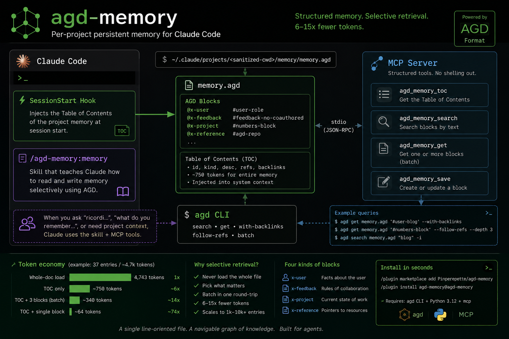

# agd-memory



Per-project persistent memory for [Claude Code](https://claude.com/claude-code),
stored in [AGD format](https://github.com/Pinperepette/agd) with selective
retrieval and graph traversal.

Each project gets its own memory file. The session never loads it whole:
it scans a Table of Contents, picks the relevant blocks, and fetches
them in a single batched call. Typical access costs **6-15x fewer
tokens** than loading the whole memory file.

## What you get

- **SessionStart hook** — at session start, injects the TOC of the
  project memory into the system context. If the project has no
  memory, the hook is a silent no-op.
- **Skill** (`/agd-memory:memory`) — when the user asks "ricordi…",
  "what do you remember…", or you need project context, the skill
  documents how to read and write the memory.
- **MCP server** — exposes four tools (`agd_memory_toc`,
  `agd_memory_search`, `agd_memory_get`, `agd_memory_save`) so the
  model can interact with memory through structured calls instead of
  shelling out.

All three components are backed by the same `agd` CLI binary. No
daemon, no broker, no embeddings — a single line-oriented file on
disk.

## Prerequisites

1. **Claude Code 2.1.138 or newer**. Older versions reject the
   marketplace `github` source with `This plugin uses a source type your
   Claude Code version does not support`. Run `claude update` to upgrade,
   then `claude --version` to confirm.
2. **`agd` CLI** (>= v0.3.1):

   ```sh
   cargo install --git https://github.com/Pinperepette/agd --tag v0.3.1
   ```

   Verify: `agd --version` prints `agd 0.3.1` or newer.

3. **Python 3.10 or newer** (for the MCP server). The plugin auto-creates a
   private venv under `${CLAUDE_PLUGIN_DATA}/venv` on first launch and
   installs the `mcp` package into it — no manual pip step. The venv is
   removed automatically on uninstall.

## Install

The plugin is distributed through a Claude Code marketplace defined in
the same repo. From a Claude Code session:

```
/plugin marketplace add Pinperepette/agd-memory
/plugin install agd-memory@agd-memory
```

Restart the session for the SessionStart hook and MCP server to load.

## How it works

### Memory file path

Each project's memory lives at:

```
~/.claude/projects/<sanitized-cwd>/memory/memory.agd
```

`sanitized-cwd` is the working directory with `/` replaced by `-`. The
hook and MCP server derive this path from `pwd` automatically — no
configuration needed.

### Block format

A memory entry is one AGD block with a stable id and an optional
`desc=` attribute that is surfaced in the TOC:

```agd
@x-feedback desc="no Co-Authored-By in commits" refs="#user-role" [#feedback-no-coauthored]
~~~
Mai aggiungere Co-Authored-By o trailer nei commit Git.
Reason: regola globale del progetto, perduta se la dimentichi.
~~~
```

Four conventional kinds keep the memory navigable:

- `x-user` — facts about the user (role, blog, style)
- `x-feedback` — rules of collaboration (preferences, anti-patterns)
- `x-project` — current state of work (decisions, artifacts)
- `x-reference` — pointers to external resources (repos, paths)

### Preferred access patterns

The wrong pattern is to call `get` repeatedly in sequence and pay one
parse per call. Three patterns that fold a multi-step retrieval into a
single round-trip:

**Scope query** — every rule that applies to a topic:

```sh
agd get memory.agd '#user-blog' --with-backlinks
```

Returns the anchor block plus every block that declares
`refs="#user-blog"`. Useful when the user asks about a scoped activity
("I am about to write a blog post — what rules apply?").

**Provenance chain** — where does this fact come from:

```sh
agd get memory.agd '#numbers-block' --follow-refs --depth 3
```

Walks `refs=` outbound transitively, cycle-safe.

**Topic discovery** — when you do not know the id:

```sh
agd search memory.agd "blog" -i
```

Returns matching ids and short excerpts. Feed those ids to a single
`agd get` batch.

## Token economy

Measured on a 37-entry memory file (~4.7k tokens total, 2026-05-09):

| pattern                            | tokens  | savings |
|------------------------------------|--------:|--------:|
| whole-doc load                     |   4,743 | 1x      |
| TOC only                           |   ~750  | ~6x     |
| TOC + batch of 3 typical blocks    |   ~340  | ~14x    |
| TOC + single-block fetch           |    ~64  | ~74x    |

The ratio scales with corpus size: at 1k entries it sits around 12x
on a 1-block selective fetch; at 10k entries closer to 14x.

## Local viewer

A bundled single-page viewer renders the memory as a long-form readable
notebook with a timeline rail, a `cmd-k` search palette, light/dark
themes, and a graph view as a toggle. Pure Python `http.server`, no
extra dependencies, opens the browser automatically.

```sh
viewer/run.sh
```

That serves the current project's memory at `http://127.0.0.1:8765/`
(or the next free port). Pass a path to view any AGD file:
`viewer/run.sh path/to/file.agd`. Inside a Claude Code session, the
`memory-view` skill triggers on phrases like "show me the memory" or
"open the memory" and starts the server in the background.

What you get:

- **Read mode** (default): blocks rendered in document order as
  paper-card sections — kind chip, id, date (parsed from id), italic
  desc, Markdown body in a serif typeface, refs and backlinks inline.
- **Timeline rail** on the left: a vertical thread of dated dots,
  one per block, that scroll-spies the reader and lets you jump.
- **⌘K / `/` search**: floating palette with arrow-key nav, matches
  id, desc, and body content.
- **Graph mode**: cytoscape force-directed layout, nodes coloured by
  kind, click a node to see its body in a side pane.
- **Light/dark theme** toggle; persists across sessions.

## Layout

```
agd-memory/
├── .claude-plugin/
│   ├── plugin.json         # plugin manifest
│   └── marketplace.json    # marketplace definition for /plugin install
├── skills/
│   ├── memory/
│   │   └── SKILL.md
│   └── memory-view/
│       └── SKILL.md
├── hooks/
│   ├── hooks.json          # registers SessionStart hook
│   └── agd-memory-bootstrap.sh
├── mcp_servers/
│   ├── run.sh              # self-bootstrapping launcher (creates venv on first run)
│   └── server.py           # MCP server, four tools
├── viewer/
│   ├── run.sh              # launcher: locates python and runs viewer.py
│   ├── viewer.py           # http.server + JSON endpoint
│   └── index.html          # single-page UI (cytoscape, markdown-it, tailwind)
├── .mcp.json               # registers the MCP server
├── requirements.txt        # mcp package
├── README.md
└── LICENSE
```

## Status

v0.1.0 — first packaged release. The standalone setup (skill + hook +
MCP server in `~/.claude/`) has been used in production for 4 months
on the development of the AGD format itself. This package wraps the
same components into a Claude Code plugin manifest with marketplace
distribution.

## Related

- [`agd`](https://github.com/Pinperepette/agd) — the format, the parser,
  the CLI. Required dependency.
- [`signal.pirate`](https://signal.pirate) — articles about AGD,
  Claude Code agents, and selective retrieval.

## License

MIT.
